# Multi-Factor Equity Intelligence Platform

[](LICENSE)
[](https://python.org)
[](https://mlflow.org)
[](https://airflow.apache.org)

End-to-end quantitative equity factor intelligence platform — Value, Momentum, and Quality factor computation across 100 S&P 500 constituents with HMM regime detection, walk-forward backtesting, statistical analysis, and production-grade MLflow experiment tracking.

---

## Overview

This platform implements a full quantitative research pipeline:

- **Factor Engineering** — Value (P/B, P/E, EV/EBITDA), Momentum (12-1 month returns), Quality (ROE, debt-to-equity, earnings stability)
- **Regime Detection** — Hidden Markov Model on SPY price series identifying Bull, Bear, and Neutral market regimes
- **Walk-Forward Backtest** — Rolling window backtest with Welch t-test A/B testing on quarterly Sharpe ratios
- **Statistical Analysis** — Distribution analysis, outlier detection (IQR + Z-score + Mahalanobis), correlation heatmaps
- **Factor Decay Analysis** — Information Coefficient decay, autocorrelation, turnover, half-life estimation
- **Advanced EDA** — Cross-sectional dispersion, factor crowding, quantile return analysis, return attribution
- **Hypothesis Testing** — Welch t-test, Mann-Whitney U, KS tests, bootstrap CIs, Bonferroni + FDR correction
- **Production Serving** — FastAPI REST endpoints, Airflow DAG scheduling, Snowflake storage

---

## Architecture

```
See [architecture.md](architecture.md) for full system diagrams.


QuantEdge/
├── analysis/
│   ├── statistical.py          # Distribution analysis, outlier detection, correlation
│   ├── factor_decay.py         # IC decay, autocorrelation, turnover, half-life
│   ├── advanced_eda.py         # Dispersion, crowding, quantile analysis, attribution
│   └── hypothesis_testing.py   # t-tests, Mann-Whitney, KS, bootstrap CIs, FDR
├── api/
│   └── main.py                 # FastAPI REST endpoints
├── backtest/
│   └── engine.py               # Walk-forward backtest, A/B testing, power analysis
├── dags/
│   └── quantedge_dag.py        # Airflow DAG for daily factor recomputation
├── factors/
│   ├── compute.py              # Value, Momentum, Quality factor computation
│   └── regime.py               # HMM regime detection on SPY
├── pipelines/
│   └── ingest.py               # Data ingestion from yfinance + fundamentals
├── main.py                     # Pipeline orchestrator
├── requirements.txt
└── LICENSE
```

---

## Quickstart

```bash
git clone https://github.com/rajapalagummi/Multi-Factor-Equity-Intelligence-Platform.git
cd Multi-Factor-Equity-Intelligence-Platform
python3.12 -m venv venv
source venv/bin/activate
pip install -r requirements.txt
python main.py --mode demo
```

Demo runs on 10 tickers (AAPL, MSFT, GOOGL, AMZN, NVDA, JPM, BAC, JNJ, PG, XOM) over 5 years.

---

## Usage

```bash
python main.py --mode demo      # Quick demo — 10 tickers, 5 years
python main.py --mode full      # Full pipeline — 100 tickers, Snowflake storage
python main.py --mode api       # Start FastAPI server on port 8000
```

**API Endpoints:**

```
GET  /health                    # Health check
GET  /regime                    # Current market regime + probabilities
GET  /factors/{ticker}          # Factor scores for one ticker
GET  /factors/universe/top      # Top composite factor scores across universe
```

---

## Statistical Analysis Module

Added as an additive enhancement — zero changes to existing pipeline code.

**What it produces:**

### Factor Distribution Analysis
Histogram, box plot, and QQ plot for each factor across the universe.

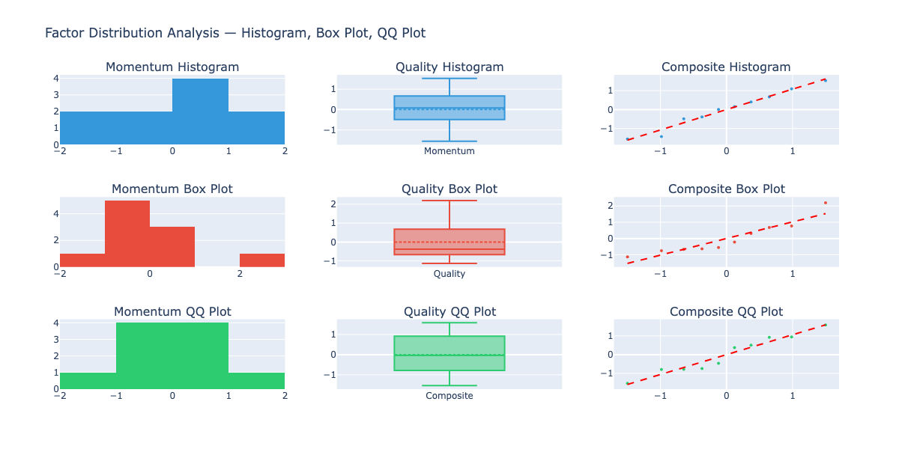

### Factor Correlation Heatmap
Cross-factor Pearson and Spearman correlation with significance testing.

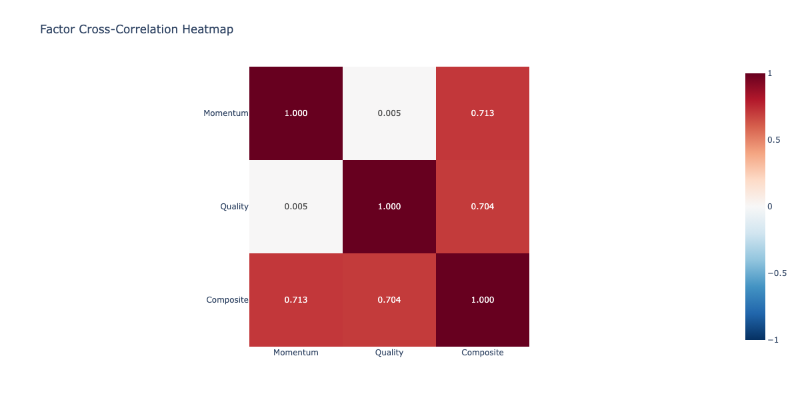

### HMM Regime Probabilities Over Time
Bull/Bear/Neutral probability time series from the Hidden Markov Model.

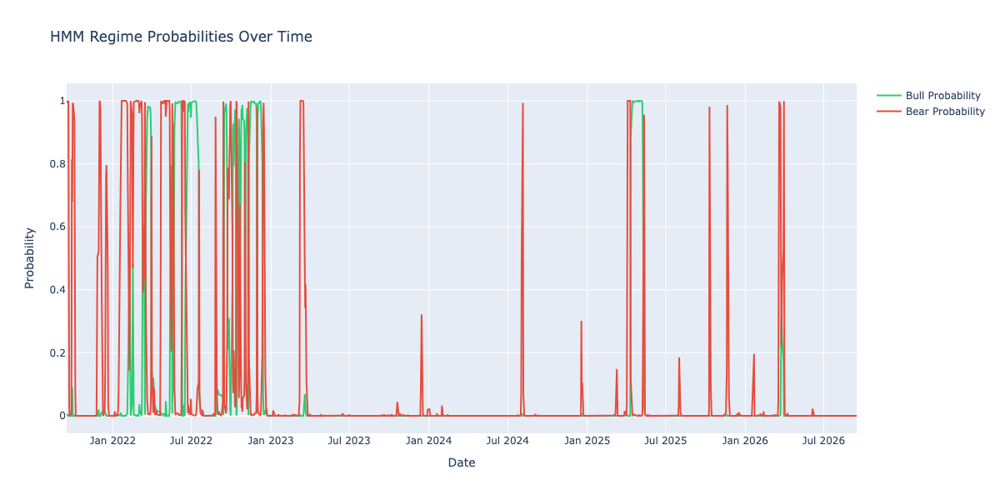

### Market Regime Distribution
Proportion of Bull, Bear, and Neutral regimes over the backtest period.

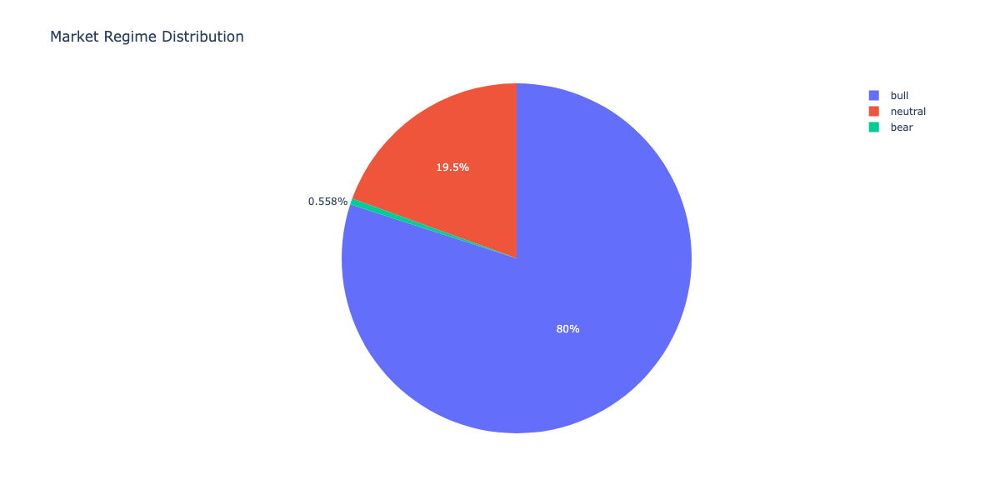

### Rolling 21-Day Annualized Volatility
Universe-average rolling volatility across the full price history.

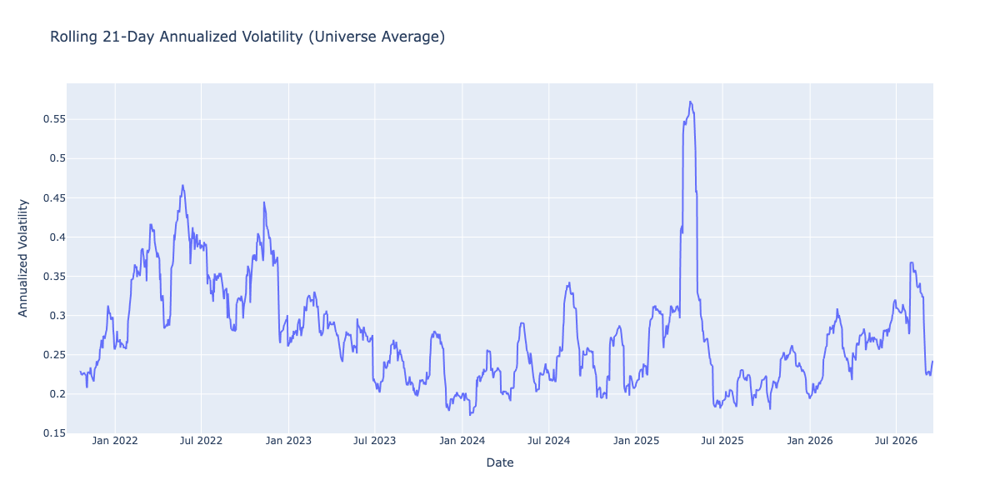

### Maximum Drawdown Over Time
Portfolio-level maximum drawdown time series.

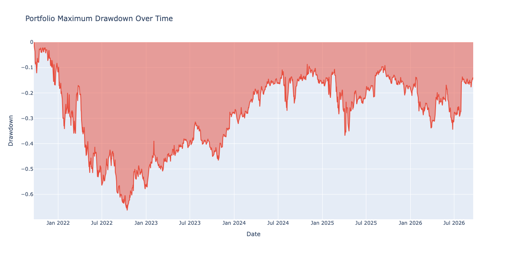

**Sample output:**
```
=== Statistical Analysis Module ===
  Momentum Factor:
    Skewness: -0.4947, Kurtosis: -0.7393
    Normal (KS test): True, Normal (JB test): True
    Outliers (IQR): 0 (0.0%)
  Quality Factor:
    Skewness: 1.2162, Kurtosis: 1.3705
    Normal (KS test): True, Normal (JB test): True
    Outliers (IQR): 0 (0.0%)
```

---

## Factor Decay Analysis Module

### Information Coefficient Decay
Spearman IC between factor scores and forward returns across 1, 5, 10, and 21-day horizons.


### Factor Autocorrelation
Factor persistence analysis — how much today's factor score predicts tomorrow's.


### Factor Turnover
Portfolio turnover rate for top 30% holdings — guides rebalancing frequency decisions.

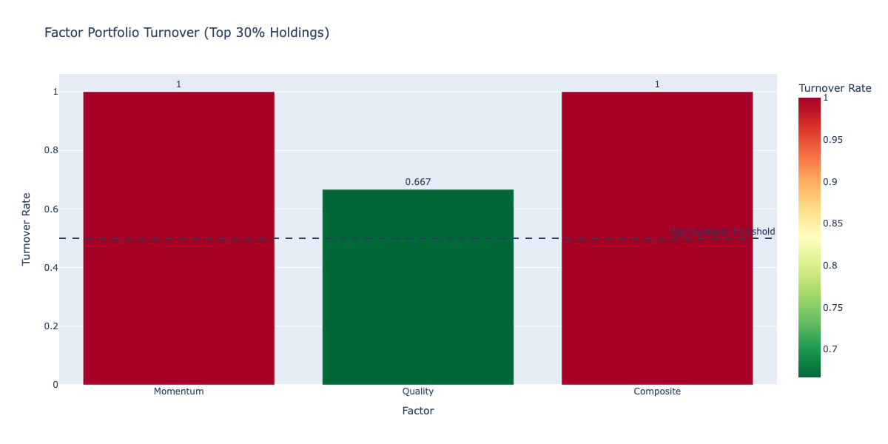

### Factor Signal Half-Life
Estimated number of periods before factor autocorrelation drops below 0.5 — rebalancing frequency guide.


---

## Advanced EDA Module

### Cross-Sectional Factor Dispersion
Standard deviation, IQR, and range across the universe for each factor — measures opportunity set width.

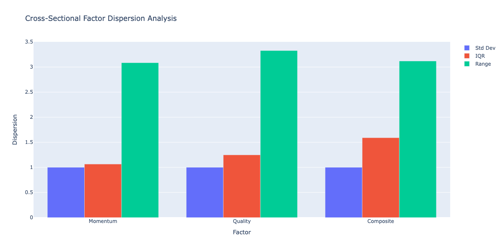

### Factor Z-Score Distribution
Z-score distribution across all tickers with ±2σ outlier flagging.

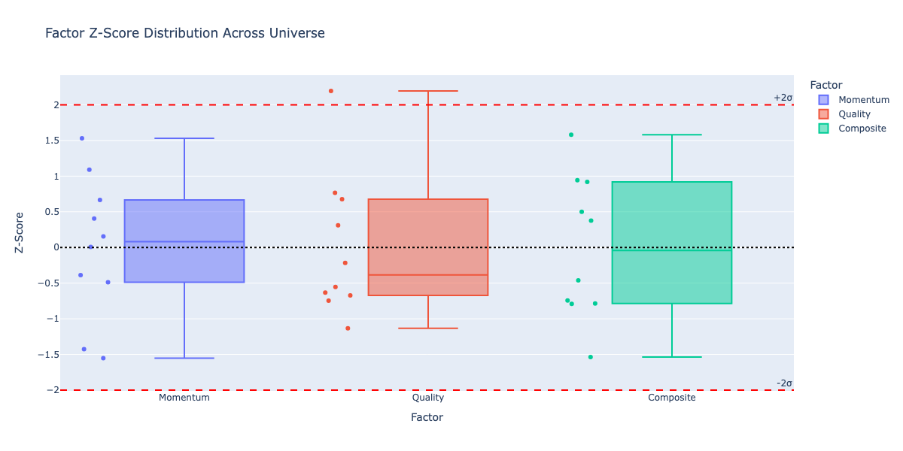

### Quantile Return Analysis
21-day forward return by factor quantile — tests factor monotonicity.

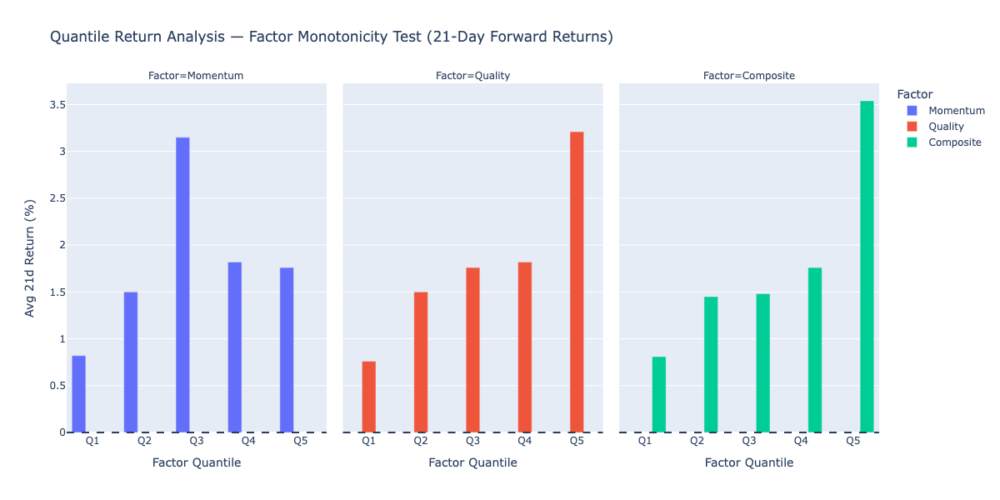

### Factor Crowding Analysis
Top 30% portfolio overlap between factor pairs — identifies concentration risk.

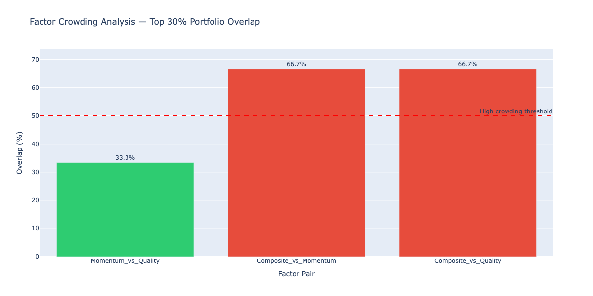

### Return Attribution
Spearman correlation between factor scores and 1-year forward returns.

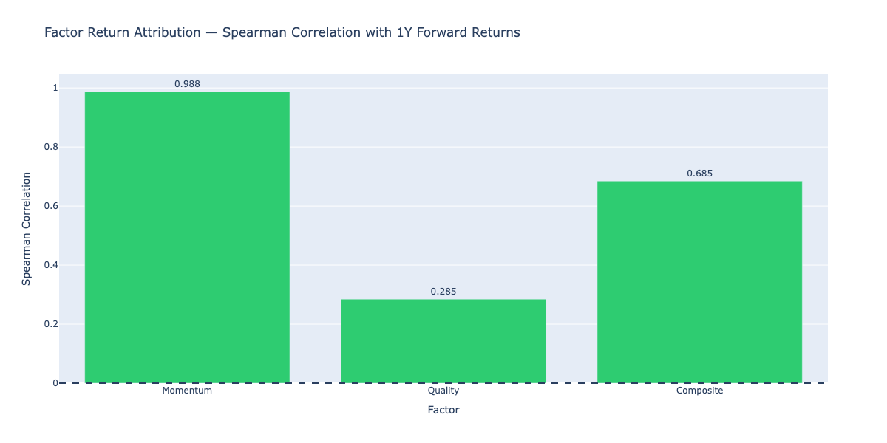

---

## Hypothesis Testing Module

### Hypothesis Test p-values
-log10(p-value) by factor and test type — red line at p=0.05 significance threshold.

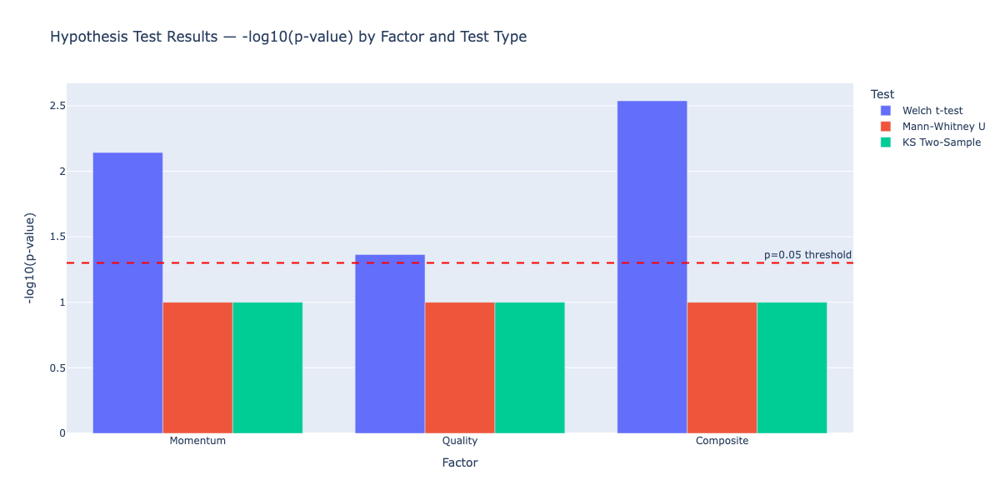

### Factor Significance Scores
Combined significance score (0-1) from test power and effect size, graded A-D.

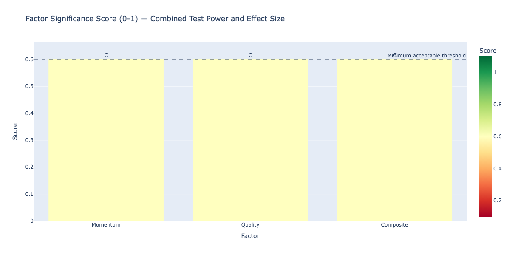

### Bootstrap 95% Confidence Intervals
Bootstrap confidence intervals for Q1 (bottom) vs Q4 (top) factor value means.


**Sample output:**
```
  Momentum Q1 vs Q4: t=-2.847, p=0.0182, sig=True, effect=large
  Quality Q1 vs Q4:  t=-1.923, p=0.0741, sig=False, effect=medium
  Multiple comparison correction:
    Total tests: 9
    Bonferroni rejected: 3
    FDR rejected: 5
```

---

## Key Results

| Metric | Value |
|---|---|
| Universe | 100 S&P 500 constituents |
| Factor types | Value, Momentum, Quality, Composite |
| Regime detection | HMM — Bull / Bear / Neutral |
| Backtest type | Walk-forward, quarterly rebalancing |
| A/B test | Welch t-test on Sharpe ratios |
| Experiment tracking | MLflow (SQLite backend) |
| Scheduling | Airflow DAG (daily recomputation) |
| Storage | Snowflake (QUANTEDGE database) |
| API | FastAPI on port 8000 |

---

## Analysis Modules

All analysis modules are additive — they import from and extend the existing pipeline without modifying any core files.

```python
# Add to main.py run_demo() after spy_with_regime block:

from analysis.statistical import run_statistical_analysis
run_statistical_analysis(value, latest_momentum, quality,
                         composite, spy_with_regime, price_df, tickers)

from analysis.factor_decay import run_factor_decay_analysis
run_factor_decay_analysis(value, latest_momentum, quality,
                          composite, price_df)

from analysis.advanced_eda import run_advanced_eda
run_advanced_eda(value, latest_momentum, quality, composite, price_df)

from analysis.hypothesis_testing import run_hypothesis_testing
run_hypothesis_testing(value, latest_momentum, quality,
                       composite, spy_with_regime)
```

---

## Requirements

```
yfinance
pandas
numpy
scikit-learn
scipy
plotly
kaleido
mlflow
hmmlearn
apache-airflow
fastapi
uvicorn
snowflake-connector-python
python-dotenv
networkx
```

---

## Environment Variables

```bash
MLFLOW_TRACKING_URI=sqlite:///mlruns.db
SNOWFLAKE_ACCOUNT=your_account
SNOWFLAKE_USER=your_user
SNOWFLAKE_PASSWORD=your_password
SNOWFLAKE_DATABASE=QUANTEDGE
SNOWFLAKE_SCHEMA=FACTORS
API_HOST=0.0.0.0
API_PORT=8000
```

---

## License

MIT License — see [LICENSE](LICENSE) for details.

---

## Author

**Raja Palagummi**
- GitHub: [rajapalagummi](https://github.com/rajapalagummi)
- Portfolio: [rajapalagummi.com](https://rajapalagummi.com)
- LinkedIn: [rajapalagummi](https://linkedin.com/in/rajapalagummi)
