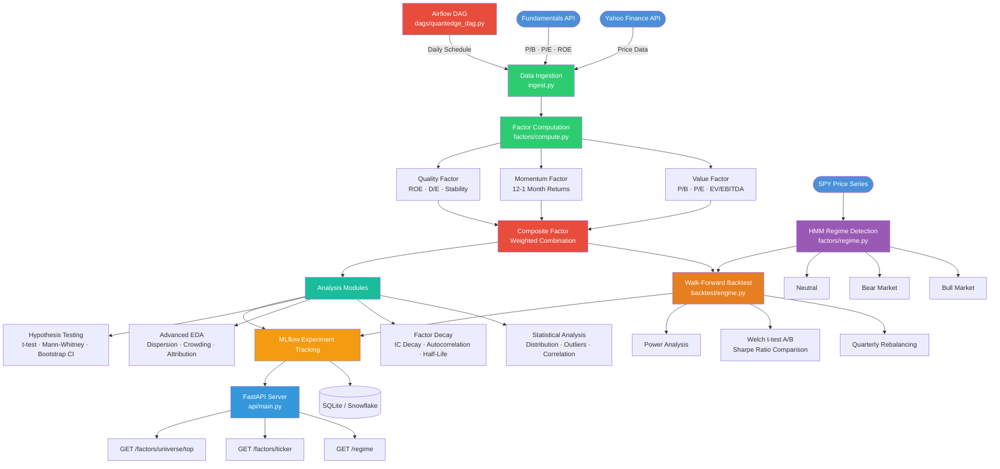
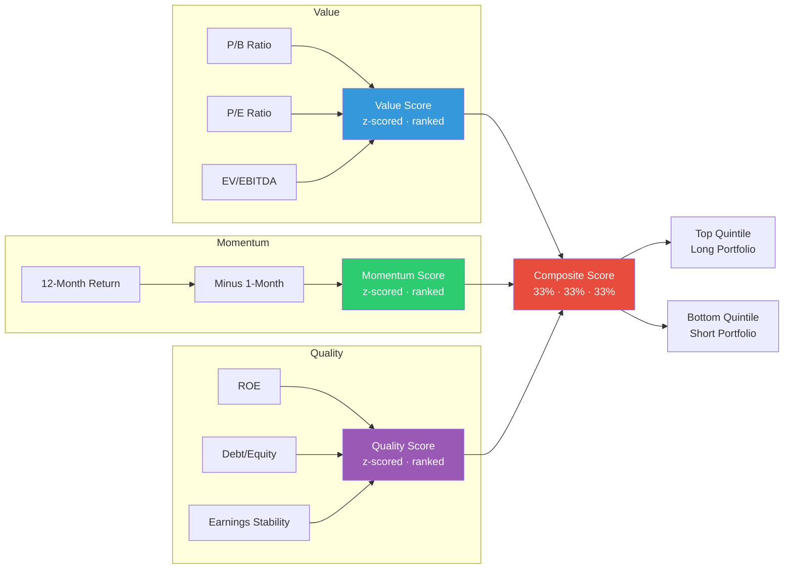
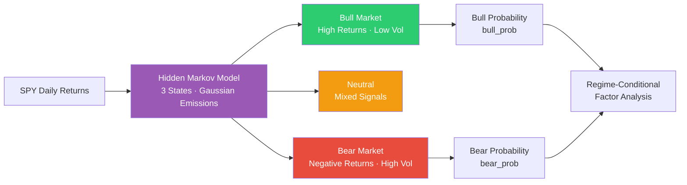
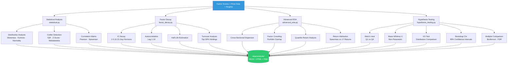
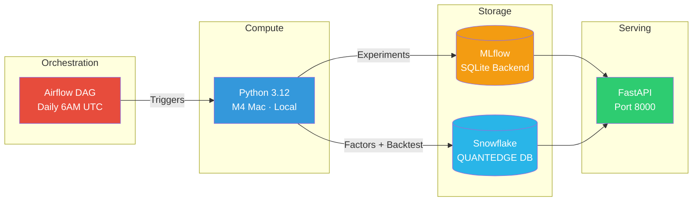

# QuantEdge — System Architecture

## Pipeline Overview

```mermaid
flowchart TD
    A([Yahoo Finance API]) -->|Price Data| B[Data Ingestion\ningest.py]
    A2([Fundamentals API]) -->|P/B · P/E · ROE| B

    B --> C[Factor Computation\nfactors/compute.py]

    C --> D1[Value Factor\nP/B · P/E · EV/EBITDA]
    C --> D2[Momentum Factor\n12-1 Month Returns]
    C --> D3[Quality Factor\nROE · D/E · Stability]

    D1 & D2 & D3 --> E[Composite Factor\nWeighted Combination]

    F([SPY Price Series]) --> G[HMM Regime Detection\nfactors/regime.py]
    G --> G1[Bull Market]
    G --> G2[Bear Market]
    G --> G3[Neutral]

    E & G --> H[Walk-Forward Backtest\nbacktest/engine.py]
    H --> H1[Quarterly Rebalancing]
    H --> H2[Welch t-test A/B\nSharpe Ratio Comparison]
    H --> H3[Power Analysis]

    E --> I[Analysis Modules]
    I --> I1[Statistical Analysis\nDistribution · Outliers · Correlation]
    I --> I2[Factor Decay\nIC Decay · Autocorrelation · Half-Life]
    I --> I3[Advanced EDA\nDispersion · Crowding · Attribution]
    I --> I4[Hypothesis Testing\nt-test · Mann-Whitney · Bootstrap CI]

    H & I --> J[MLflow Experiment Tracking]
    J --> J1[(SQLite / Snowflake)]

    J --> K[FastAPI Server\napi/main.py]
    K --> K1[GET /regime]
    K --> K2[GET /factors/ticker]
    K --> K3[GET /factors/universe/top]

    L[Airflow DAG\ndags/quantedge_dag.py] -->|Daily Schedule| B

    style A fill:#4A90D9,color:#fff
    style A2 fill:#4A90D9,color:#fff
    style F fill:#4A90D9,color:#fff
    style B fill:#2ECC71,color:#fff
    style C fill:#2ECC71,color:#fff
    style E fill:#E74C3C,color:#fff
    style G fill:#9B59B6,color:#fff
    style H fill:#E67E22,color:#fff
    style I fill:#1ABC9C,color:#fff
    style J fill:#F39C12,color:#fff
    style K fill:#3498DB,color:#fff
    style L fill:#E74C3C,color:#fff
```

## Factor Engineering

```mermaid
flowchart LR
    subgraph Value
        V1[P/B Ratio] & V2[P/E Ratio] & V3[EV/EBITDA] --> V4[Value Score\nz-scored · ranked]
    end

    subgraph Momentum
        M1[12-Month Return] --> M2[Minus 1-Month] --> M3[Momentum Score\nz-scored · ranked]
    end

    subgraph Quality
        Q1[ROE] & Q2[Debt/Equity] & Q3[Earnings Stability] --> Q4[Quality Score\nz-scored · ranked]
    end

    V4 & M3 & Q4 --> C[Composite Score\n33% · 33% · 33%]
    C --> TOP[Top Quintile\nLong Portfolio]
    C --> BOT[Bottom Quintile\nShort Portfolio]

    style V4 fill:#3498DB,color:#fff
    style M3 fill:#2ECC71,color:#fff
    style Q4 fill:#9B59B6,color:#fff
    style C fill:#E74C3C,color:#fff
```

## HMM Regime Detection

```mermaid
flowchart LR
    SPY[SPY Daily Returns] --> HMM[Hidden Markov Model\n3 States · Gaussian Emissions]
    HMM --> B[Bull Market\nHigh Returns · Low Vol]
    HMM --> N[Neutral\nMixed Signals]
    HMM --> BR[Bear Market\nNegative Returns · High Vol]

    B --> BP[Bull Probability\nbull_prob]
    BR --> BRP[Bear Probability\nbear_prob]
    BP & BRP --> RC[Regime-Conditional\nFactor Analysis]

    style HMM fill:#9B59B6,color:#fff
    style B fill:#2ECC71,color:#fff
    style N fill:#F39C12,color:#fff
    style BR fill:#E74C3C,color:#fff
```

## Analysis Pipeline

```mermaid
flowchart TD
    IN[Factor Scores + Price Data + Regime] --> S[Statistical Analysis\nstatistical.py]
    IN --> D[Factor Decay\nfactor_decay.py]
    IN --> E[Advanced EDA\nadvanced_eda.py]
    IN --> H[Hypothesis Testing\nhypothesis_testing.py]

    S --> S1[Distribution Analysis\nSkewness · Kurtosis · Normality]
    S --> S2[Outlier Detection\nIQR · Z-Score · Mahalanobis]
    S --> S3[Correlation Matrix\nPearson · Spearman]

    D --> D1[IC Decay\n1·5·10·21 Day Horizons]
    D --> D2[Autocorrelation\nLag 1-10]
    D --> D3[Half-Life Estimation]
    D --> D4[Turnover Analysis\nTop 30% Holdings]

    E --> E1[Cross-Sectional Dispersion]
    E --> E2[Factor Crowding\nPortfolio Overlap]
    E --> E3[Quantile Return Analysis]
    E --> E4[Return Attribution\nSpearman vs 1Y Returns]

    H --> H1[Welch t-test\nQ1 vs Q4]
    H --> H2[Mann-Whitney U\nNon-Parametric]
    H --> H3[KS Test\nDistribution Comparison]
    H --> H4[Bootstrap CIs\n95% Confidence Intervals]
    H --> H5[Multiple Comparison\nBonferroni · FDR]

    S1 & S2 & S3 & D1 & D2 & D3 & D4 & E1 & E2 & E3 & E4 & H1 & H2 & H3 & H4 & H5 --> OUT[(data/analysis/\nJSON + HTML + PNG)]

    style IN fill:#3498DB,color:#fff
    style OUT fill:#2ECC71,color:#fff
```

## Production Stack

```mermaid
flowchart LR
    subgraph Orchestration
        AIR[Airflow DAG\nDaily 6AM UTC]
    end

    subgraph Compute
        PY[Python 3.12\nM4 Mac · Local]
    end

    subgraph Storage
        SF[(Snowflake\nQUANTEDGE DB)]
        ML[(MLflow\nSQLite Backend)]
    end

    subgraph Serving
        API[FastAPI\nPort 8000]
    end

    AIR -->|Triggers| PY
    PY -->|Factors + Backtest| SF
    PY -->|Experiments| ML
    ML & SF --> API

    style AIR fill:#E74C3C,color:#fff
    style PY fill:#3498DB,color:#fff
    style SF fill:#29B5E8,color:#fff
    style ML fill:#F39C12,color:#fff
    style API fill:#2ECC71,color:#fff
```
